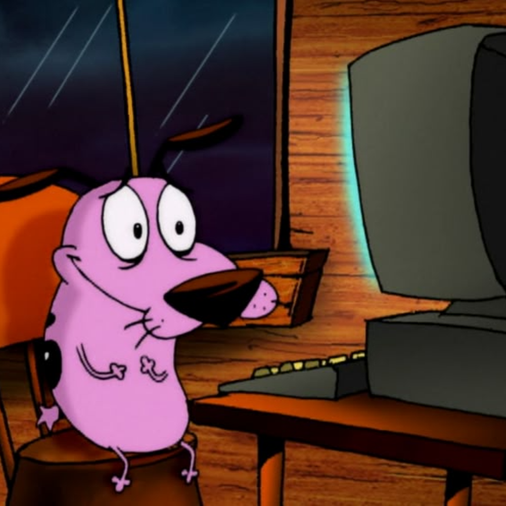

  

# Grave
   

Grave A Quality Music Bot which Makes You Feel the Music and it's Beats

---

# Grave Terms of Service
Thank you for choosing Grave! By using our music bot, you agree to the following terms. Please read them carefully.

## Changes to Terms

We may update these terms at any time without prior notice. It’s your responsibility to review them regularly to stay informed.

## Ownership and Usage

Grave is dedicated to providing you with the best music experience. We reserve the right to modify the bot and its services as needed. If any charges are introduced, we will clearly communicate what you’re paying for.

By using Grave, you accept these terms. You are prohibited from copying, altering, or extracting the source code of the bot. All intellectual property rights, including trademarks and copyrights, belong to Nirvana's owner.

## Service Updates and Termination

We may periodically update Grave and reserve the right to discontinue the service at any time with prior notice.

## Usage Restrictions

Grave enables you to play music in Discord channels while maintaining server accountability. The server owner is responsible for all actions taken by the bot.

### You may not:

- Use Grave to send advertisements or promotional content.
- Obscure the server name from which music is being streamed.
- Send spam or repetitive messages, particularly in direct messages.
- Use Grave on servers that violate Discord’s Community Guidelines or in any way that goes against them.
- Deceive or mislead users, especially regarding sensitive information like passwords.
- Misuse our support services or submit false abuse reports.
- Engage in unauthorized linking or framing of the bot.
- Attempt to bypass any access restrictions put in place by Grave.
- Utilize any form of unauthorized automation within Discord.

## Note

Violating any of the above terms may result in blacklisting and removal from our services.

## Permanent Link

[Support](https://discord.gg/funereal)

Thank you for using Grave! Enjoy your music experience!
